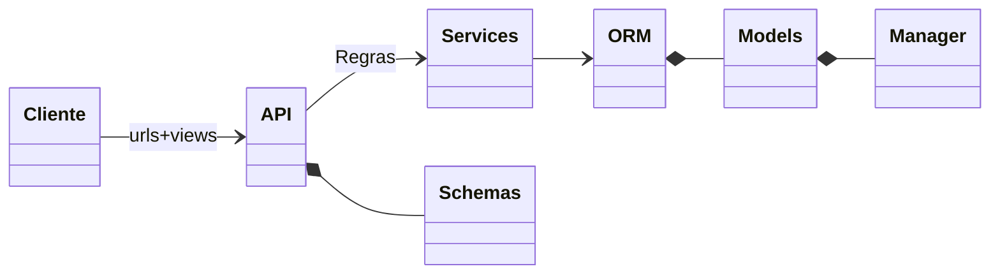
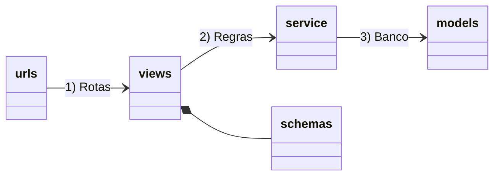
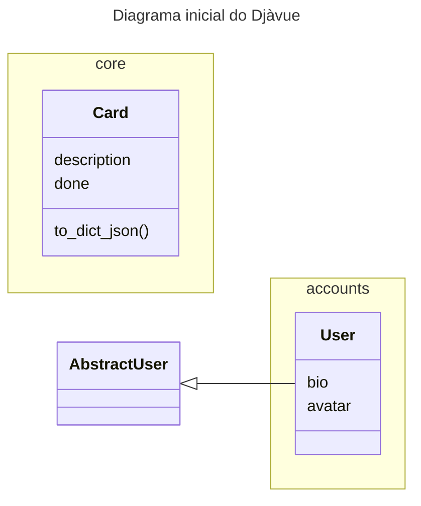

# 🐍 Jiboia

## Product

**Jiboia** é um sistema de **ETL de dados do Jira** que transforma informações brutas em métricas úteis para acompanhamento de projetos.  
O objetivo é dar visibilidade sobre o andamento, esforço e performance das equipes, oferecendo dashboards detalhados tanto em nível de **projetos** quanto de **issues**.


---

## ✨ Funcionalidades

### 🔹 Gestão de Projetos
- Listagem de todos os projetos cadastrados.
- Visualização das seguintes informações por projeto:
  - Data de início e data final.
  - Timezone configurado.
  - Quantidade de issues.
  - Total de horas gastas.
  - Valor da hora do projeto *(a confirmar com o cliente)*.
  - Valor total gasto em horas *(horas × valor hora)*.
- Seleção de um projeto para detalhamento de suas **issues**.

### 🔹 Gestão de Issues
- Visualização das informações de cada issue:
  - ID da issue.
  - Autor.
  - Data de criação.
  - Data de início.
  - Tempo gasto.

### 🔹 Gestão de Usuários
- Três níveis de autorização:
  - **Gerente de Projetos**
  - **Líder de Equipe**
  - **Membro de Equipe**

---

## 📊 Dashboards

### Nível de Projetos
- Quantidade de issues por projeto.
- Quantidade de horas trabalhadas por projeto.
- Quantidade de membros atuando no projeto.
- **Filtros disponíveis:**
  - Projeto.
  - Intervalo de datas (início/fim).

### Nível de Issues
- Taxa de conclusão das issues.
- Tempo médio de resolução.
- Issues resolvidas por membro e totais do time.
- Horas trabalhadas por membro e totais do time.
- **Filtros disponíveis:**
  - Intervalo de datas de início da issue.
  - Intervalo de datas de criação da issue.
  - Filtro por membro da equipe.


## TECH 
### BACKEND Django API

### Organização das camadas



- **Cliente**: Chamadas HTTP para a API
- **API**: Tem as definições de rotas e validação dos dados de entrada, sem ou pouca regras de negócio, redireciona os dados para a camada de serviço
- **Services**: Módulos python puro com a implementação das regras de negócio, é a camada que mais deve ser testada
- **ORM**: Mapeamento dos dados na base de dados


### Estrutura de pastas

Visao geral

```shell
jiboia                   👉 Pasta raiz do projeto
 ├── README.md
 ├── manage.py                     👉 Django CLI (Ponto de entrada)
 ├── requirements.txt              👉 Dependencias principais
 ├── requirements-dev.txt          👉 Dependencias locais (pode mudar no modo Poetry)
 ├── pyproject.toml
 ├── uwsgi.ini
 └── jiboia              👉 base do projeto
    ├── base                       👉 app para regras fora do "core"
    │   └── ...
    ├── accounts                   👉 app relacionado a usuarios e autenticacao
    │   └── ...
    ├── core                       👉 app principal com o "core business" 
    │   └── ...
    └── jiboia           👉 centraliza configuracoes do projeto
        ├── api.py
        ├── settings.py            👉 Configuracoes principal do Django
        ├── urls.py                👉 Configuracao principal/inicial das rotas no Django
        └── wsgi.py
```

O Django tem o conceito de "apps" com a ideia de separar os contextos do seu projeto, ao invés de ter tudo na app principal, podemos ir criando novas apps como por exemplo, dashboard, issue, card,  agrupar funcionalidades da mesma natureza. Cada app segue a estrutura abaixo: 



```shell
├── core                       👉 Raiz da django app para centralizar uma solução de um dado contexto
│   ├── apps.py                👉 Como um __init__ da app
│   ├── urls.py                👉 1) Definição das rotas
│   ├── views.py               👉 1) Implementação das rotas
│   ├── schemas.py             👉 1) Definição dos atributos nome/tipo 
│   ├── service                👉 2) Implementação das regras de negócio
│   ├── models.py              👉 3) Definição das tabelas para salvar os dados
│   ├── migrations             👉 3) Histórico de como criar/alterar as tabelas no banco de dados
│   ├── admin.py               👉 Configuração dos dados que podemos acessar via back-office
│   ├── tests                  👉 Centraliza os testes da app
│   └── templates              👉 Não utilizado nas apps de API, mas pode gerar páginas HTML


```

### Diagrama de Entidade e Relacionamento

- Inicialmente o projeto tem apenas uma tabela na aplicação principal (core): Card
- O Django já fornece a tabela de usuários (User), a qual está organizada na app accounts. Note que podemos adicionar campos adicionais na tabela de usuário.

**🌈 NOTA:** Em versões mais antigas do Django, a forma de adicionar campos extras na tabela User era utilizando a tabela `Profile` com um relacionamento 1 para 1 com a User. Na versão mais nova do Django, podemos estender a tabela user diretamente igual está feito na app `accounts.models.User`.



## Rodando o projeto

## Requisitos

- Git
- 🐍 Python 3.11.x 
- Um terminal (de preferência um terminal Linux, é para funcionar em um terminal WSL no Windows)

Temos três formas para **Rodar**:
- Sem Docker 📦: Apenas **Python** instalando requiriments.txt
- Apenas Banco de dados usando 🐋 Docker (melhor para debug)