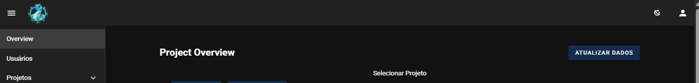
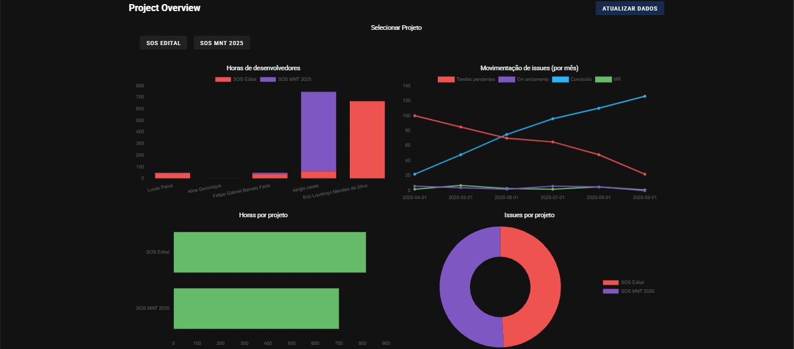
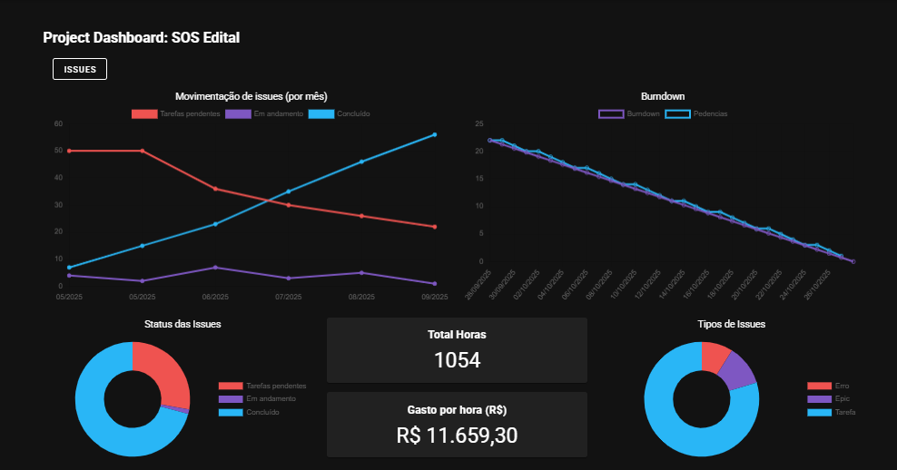
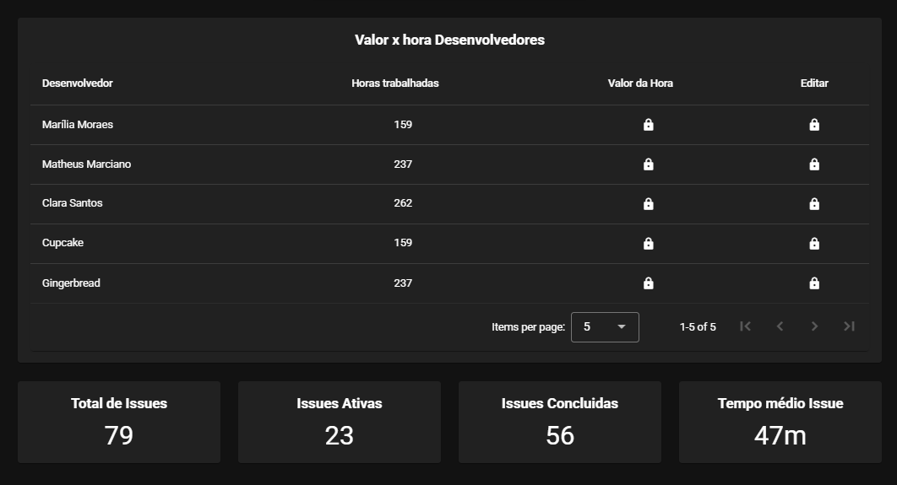
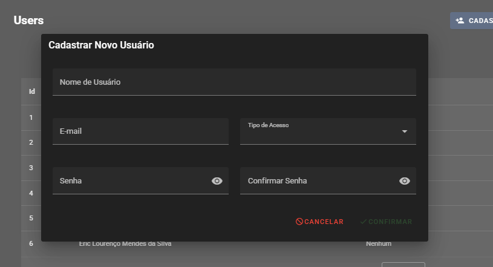

# Manual do Usuário – Sistema Jiboia (Necto <-> Jiboia)

## Sumário
* [1. Introdução](#1-introdução)
* [2. Acesso ao Sistema](#2-acesso-ao-sistema)
* [3. Login e Permissões](#3-login-e-permissões)
* [4. Navegação e Menus](#4-navegação-e-menus)
    * [4.1. Barra Superior (Topo)](#41-barra-superior-topo)
    * [4.2. Menu Lateral (Esquerda)](#42-menu-lateral-esquerda)
* [5. Funcionalidades Principais](#5-funcionalidades-principais)
    * [5.1. Visão Geral dos Projetos (Project Overview)](#51-visão-geral-dos-projetos-project-overview)
    * [5.2. Painel Detalhado do Projeto (Project Dashboard)](#52-painel-detalhado-do-projeto-project-dashboard)
    * [5.3. Gestão de Custos e Métricas Gerais](#53-gestão-de-custos-e-métricas-gerais)
* [6. Gestão Administrativa](#6-gestão-administrativa)
    * [6.1. Cadastrar Novos Usuários](#61-cadastrar-novos-usuários)
* [Dúvidas](#dúvidas)
---

## 1. Introdução
O sistema **Jiboia** é uma ferramenta criada para simplificar o acompanhamento dos seus projetos. Ele se conecta diretamente ao Jira para coletar as informações sobre equipes e tarefas (*issues*) e, em seguida, organiza esses dados em dashboards visuais e relatórios claros.

O objetivo é oferecer uma visão completa e intuitiva sobre o andamento do trabalho, a performance da equipe e o esforço dedicado a cada atividade.

---

## 2. Acesso ao Sistema
* Abra o navegador e acesse o endereço: **[https://jiboia.app/](https://jiboia.app/)**
* Realize login com seu e-mail e senha cadastrados.

---

## 3. Login e Permissões
Ao entrar com seu usuário e senha, a plataforma adapta a interface para o seu perfil.

Existem quatro níveis de acesso:
* **Administrador:** Possui acesso total ao sistema. É o único perfil com permissão para gerenciar usuários (cadastrar, editar e remover).
* **Gerente:** Tem acesso a todos os dashboards e relatórios, incluindo as informações de custos dos projetos.
* **Líder de Equipe:** Visualiza os dashboards de projetos e equipes que lidera, mas sem acesso às informações de custos.
* **Membro de Equipe:** Pode visualizar os dashboards relacionados aos seus projetos e tarefas, também sem acesso aos dados de custos.

---

## 4. Navegação e Menus
A barra superior e o menu lateral estão presentes em todas as telas, servindo como o seu "controle remoto" para navegar pelo sistema Jiboia.

### 4.1. Barra Superior (Topo)
Aqui você encontra os controles de exibição e acesso pessoal.

* **☰ Menu:** Localizado no canto esquerdo. Clique aqui para **expandir ou recolher** o menu lateral. Útil quando você quer ganhar mais espaço na tela para ver os gráficos.
* **🐍 Logo Jibóia:** Clique na logo a qualquer momento para atualizar a página.
* **🌙 Tema (Canto Direito):** Alterna o visual do sistema entre **Modo Claro** e **Modo Escuro**. Use conforme o seu conforto visual ou iluminação do ambiente.
* **👤 Perfil:** Botão para realizar o **Logout** (sair do sistema).

### 4.2. Menu Lateral (Esquerda)
É aqui que você escolhe qual módulo do sistema deseja acessar.

* **Overview:** Leva você de volta para a Visão Geral com todos os gráficos de saúde dos projetos.
* **Usuários:** Área para gestão de cadastro de pessoas e permissões de acesso (Geralmente restrito a administradores).
* **Projetos:** Um menu expansível. Ao clicar, ele abre a lista de todos os projetos cadastrados para que você possa selecionar um especificamente.

---

## 5. Funcionalidades Principais

### 5.1. Visão Geral dos Projetos (Project Overview)
Ao fazer login no sistema Jibóia, esta é a sua tela inicial. Este painel centraliza a saúde de todos os projetos conectados ao Jira.

#### 5.1.1. Elementos da Tela
* **Botão "Atualizar Dados":** Localizado no canto superior direito. Clique aqui sempre que quiser garantir que os números na tela estejam sincronizados com a última versão do Jira.
* **Seletor de Projetos:** Botões com os nomes dos projetos (ex: *SOS EDITAL*, *SOS MNT 2025*), para filtrar todos os gráficos apenas com dados daquele projeto.

####  Horas de Desenvolvedores (Barras Verticais)
Mostra a produtividade individual da equipe.
* **O que observar:** Cada barra é um membro da equipe. A altura da barra indica quantas horas foram trabalhadas.
* **Para que serve:** Identificar rapidamente quem está sobrecarregado ou quem está mais dedicado a qual projeto (diferenciado pelas cores).

####  Movimentação de Issues (Linhas)
Mostra a história e a evolução do projeto mês a mês. Entenda as linhas:
* 🔵 **Linha Azul (Concluído):** Entregas feitas. O ideal é que essa linha suba sempre.
* 🔴 **Linha Vermelha (Pendentes):** O que falta fazer. O saudável é que ela caia com o tempo.
* 🟣 **Linha Roxa (Em andamento):** O ritmo de trabalho atual da equipe.

####  Horas por Projeto (Barras Verdes)
Um comparativo direto do esforço total.
* **O que mostra:** O acúmulo total de horas investidas em cada projeto desde o início. As barras maiores indicam projetos que demandaram mais tempo da equipe.

####  Issues por Projeto (Gráfico de Rosca)
A proporção de tarefas entre os projetos.
* **O que mostra:** Divide o total de tarefas (issues) existentes. Fatias maiores representam projetos com maior volume de requisições ou cards no Jira.

---

### 5.2. Painel Detalhado do Projeto (Project Dashboard)
Ao clicar em qualquer projeto na tela inicial, você será direcionado para este Dashboard exclusivo. Aqui, o gestor tem acesso a métricas de Agile (Burndown), Financeiro e Qualidade.

#### 5.2.1. Movimentação de Issues (Esquerda)
Mostra o histórico de batalha entre o que precisa ser feito e o que já foi entregue.
* **🔴 Linha Vermelha (Pendentes):** O trabalho restante.
* **🟣 Linha Roxa (Em andamento):** O trabalho que está a ser executado ativamente no momento.
* **🔵 Linha Azul (Concluído):** O trabalho entregue.

#### 5.2.2. Burndown Chart (Direita)
Uma ferramenta clássica de gestão ágil que mede a velocidade da equipe dia a dia.
* **Linha Roxa (Guia):** O ritmo ideal para entregar o projeto no prazo.
* **Linha Azul Clara (Realidade):** Como a equipe está realmente a desempenhar.

#### 5.2.3. Indicadores de Custo e Esforço (Centro)
Localizados logo abaixo dos gráficos, estes cartões (KPIs) focam no orçamento e esforço da equipe.
* **Total Horas:** Soma de todo o tempo logado pelos desenvolvedores neste projeto específico (ex: 1054 horas).
* **Gasto por hora (R$):** Valor monetário total do projeto até o momento.

#### 5.2.4. Distribuição e Classificação (Parte Inferior)
Os gráficos de rosca (Donut Charts) oferecem um "raio-x" da composição do trabalho.

**Status das Issues (Esquerda)**
Mostra a porcentagem atual de conclusão do projeto.

**Tipos de Issues (Direita)**
Categoriza o tipo de demanda que a equipe está enfrentando:
* 🔵 **Tarefa (Azul):** Desenvolvimento de novas funcionalidades.
* 🔴 **Erro (Vermelho):** Correção de bugs ou falhas.
* 🟣 **Epic (Roxo):** Grandes blocos de funcionalidades ou iniciativas maiores.

#### 5.2.5. Navegação Interna
* **Botão "ISSUES":** Localizado no canto superior esquerdo. Ao clicar neste botão, você irá para a tela que lista as issues do projeto de forma tabular.

---

### 5.3. Gestão de Custos e Métricas Gerais
Na parte inferior do dashboard, você encontra a visão detalhada de recursos humanos e o resumo estatístico do projeto.

#### Tabela: Valor x Hora dos Desenvolvedores
Esta lista detalha o esforço individual de cada membro da equipe.
* **Desenvolvedor:** Nome do colaborador.
* **Horas trabalhadas:** Total de tempo investido por essa pessoa no projeto.

> **🔒 Permissão de Acesso (Cadeados)**
> Você notará que as colunas **Valor da Hora** e **Editar** podem estar ocultas com um ícone de cadeado.
> * **Por segurança:** Apenas usuários com perfil de **Administrador** ou **Gestor** têm permissão para visualizar os valores monetários e editar taxas.
> * Se você não possui esse perfil, o sistema oculta esses dados automaticamente para preservar a confidencialidade dos contratos.

#### Cartões de Métricas (KPIs)
Quatro indicadores fundamentais para entender o volume e a velocidade do projeto:
* **Total de Issues:** A soma de todas as tarefas já criadas para este projeto.
* **Issues Ativas:** Quantas tarefas estão em andamento neste momento.
* **Issues Concluídas:** O número de tarefas que já foram finalizadas e entregues com sucesso.
* **Tempo médio Issue:** Indica, em média, quanto tempo leva para resolver uma única tarefa.

---

## 6. Gestão Administrativa

### 6.1. Cadastrar Novos Usuários
> **🔒 Atenção:** Esta funcionalidade é restrita. Apenas usuários com perfil de **Administrador** podem cadastrar novas pessoas.

Para adicionar um novo membro à equipe, acesse a opção **Usuários** no menu lateral e clique no botão de cadastro. A janela abaixo será aberta:

#### Preenchimento dos Campos
* **Nome de Usuário:** Digite o user ou a identificação do colaborador (será utilizado para o login).
* **E-mail:** Insira o e-mail corporativo.
* **Tipo de Acesso:** Selecione no menu suspenso o nível de permissão:
    * *Exemplo:* Administrador, Gestor ou Membro (Isso definirá se o usuário pode ver valores financeiros ou apenas tarefas).
* **Senha / Confirmar Senha:** Crie a senha inicial de acesso.
    * 👁️ **Dica:** Clique no pequeno ícone de "olho" dentro do campo para revelar a senha enquanto digita, garantindo que a confirmação esteja idêntica.

#### Finalização
* **🔴 CANCELAR:** Fecha a janela sem salvar nada.
* **✅ CONFIRMAR:** Salva o registro. O novo usuário terá acesso imediato ao sistema com as credenciais criadas.

---

### Dúvidas
Para dúvidas, consulte a documentação técnica ou entre em contato com a equipe de desenvolvimento.