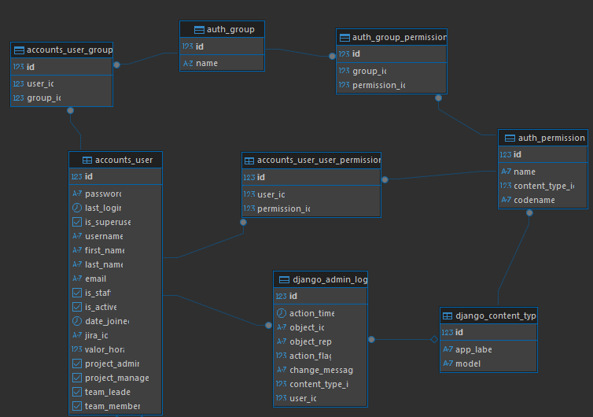
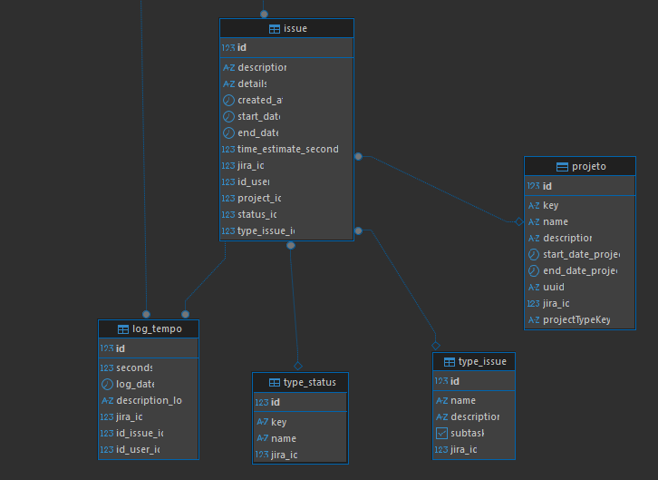
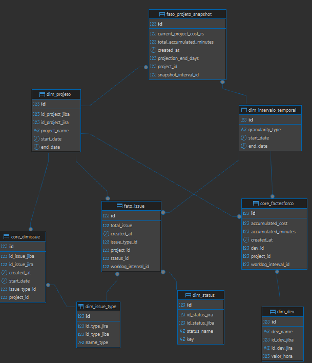

# Documentação de Banco de Dados

## 1. Visão Geral do Banco de Dados
Este documento visa mostrar como é tratado a parte de alteração do banco de dados utilizando migrations.

## 2. Estrutura de pasta
A estrutura de pasta do nosso código foi divida em 2 partes para um melhor controle na hora do desenvolvimento, a primeira pasta se encontra a entidade de usuários, tudo que está relacionado a permissões de usuário, o caminho se encontra aqui:

_\FATEC-API-5-SEMESTRE\jiboia\accounts_

Suas entidades e relacionamentos são essas:


Já a segunda parte onde fica o _core business_ do nosso projeto
fica situado:

_\FATEC-API-5-SEMESTRE\jiboia\core_

Suas entidades e relacionamento são essas:

[Detalhes da tabela](https://github.com/c137santos/FATEC-API-5-SEMESTRE/wiki)



[Detalhes Snowflake](dimensional_db_doc.md)



## 3. Desafios técnicos

Atualmente a equipe utiliza Django migrations para realizar as alterações de banco, porém ela tem algumas desvantagens que podem acabar atrapalhando no fluxo do desenvolvimento:

1. **Falta de Controle de Versão**: Os frameworks ORM não fornecem controle de versão integrado para alterações no esquema do banco de dados. Isso dificulta o rastreamento e o gerenciamento das mudanças ao longo do tempo.

2. **Migrações Imperativas**: Mudanças de esquema são gerenciadas imperativamente por meio de modificações nas classes de entidade, que podem ser opacas e difíceis de rastrear.

3. **Ambientes Inconsistentes**: Atualizações automáticas de esquemas podem levar a inconsistências em diferentes ambientes (desenvolvimento, testes, produção).

4. **Desafios Reversão**: A reversão das alterações não é simples e geralmente requer intervenção manual ou scripts personalizados.

5. **Migrações Complexas**: As ferramentas ORM lutam com migrações complexas envolvendo transformações de dados, armazenamento de procedures e triggers.

Como solução para esses problemas, optamos por utilizar uma ferramenta externa, o **Liquibase**, que lida muito bem com esses problemas e tem muito mais recursos performaticos:
Segue suas vantagens técnicas:

1. **Controle de Versão para Esquema de Banco de Dados**
    A ferramenta fornece controle de versão para alterações no esquema do banco de dados. Cada mudança é registrada como um script de migração, garantindo um histórico claro de modificações.

2. **Migrações Declarativas**
    As migrações são definidas declarativamente usando formatos SQL, XML, YAML ou JSON. Isso torna as mudanças explícitas e fáceis de entender.

3. **Trilha de Auditoria Detalhada**
    Contém uma trilha de auditoria detalhada de todas as mudanças de esquema, facilitando o rastreamento do que foi alterado, quando e por quem.

4. **Integração com Git Actions**
    Pode ser facilmente integrado em pipelines CI/CD, permitindo que as migrações sejam aplicadas automaticamente durante o processo de implantação.

### 4. Implementação de uma Migration
Primeiro passo é criar o arquivo de migration na pasta liquibase/changes, seguindo o padrão já existente, exemplo:
**002-create-products-table.sql**,
caso for uma correção de algo já existente, criar uma pasta nova chamada Migration_data_fix e colocar o arquivo lá dentro, isso permite uma melhor visão da evolução do banco e uma melhor rastreabilidade. E por fim, adicionar o arquivo no **db.changelog-master.yaml** conforme o exemplo abaixo:
```yaml
   - include:
       file: changes/002-create-products-table.sql
   - include:
       file: Migration_data_fix/001-fix_create_table.sql
```
