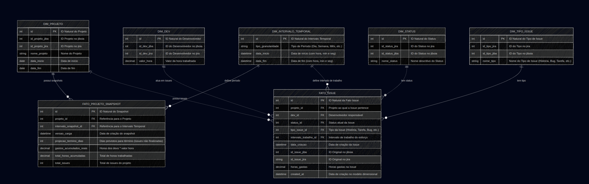

# Descrição do Modelo Dimensional de Projetos
Este modelo utiliza o esquema Star (Estrela), otimizado para análises de desempenho e custos, com foco na imutabilidade dos registros de transação (Fato_issue) e na captura do estado do projeto ao longo do tempo (Fato_snapshot_projeto).



# 🧩 Modelo: FactProjectSnapshot

O modelo **FactProjectSnapshot** representa um registro histórico consolidado do andamento de um projeto em um determinado intervalo temporal.

Ele faz parte da camada de **fatos** do modelo dimensional, sendo utilizado para análises de **desempenho**, **produtividade** e **custos acumulados** ao longo do tempo. Cada instância reflete um *snapshot* (foto no tempo) do projeto, relacionando métricas de execução, esforço e custo em um período definido por `snapshot_interval`.

---
## 🔗 Relações (Foreign Keys)

| Campo | Referência | Descrição |
| :--- | :--- | :--- |
| **projeto** | `DimProjeto` | Referência ao projeto monitorado. Cada fato está vinculado a um projeto específico. |
| **snapshot_interval** | `DimIntervaloTemporal` | Indica o intervalo de tempo (por exemplo, semana, mês ou sprint) ao qual o snapshot se refere. Permite análises temporais e comparativas entre períodos. |

---
## 📊 Métricas e Indicadores (Campos de Fato)

| Campo | Tipo | Descrição |
| :--- | :--- | :--- |
| **created\_at** | `DateTimeField` | Data de criação do snapshot no modelo dimensional, representando o momento em que os dados foram consolidados. |
| **dias\_faltando\_fim\_projeto** | `IntegerField` | Número de dias restantes até o término planejado do projeto, considerando a data da última issue cadastrada. **→ Indica o quanto o projeto ainda deve durar.** |
| **projecao\_termino\_dias** | `IntegerField` | Soma dos dias previstos nas issues ainda não concluídas. **→ Mede a projeção de tempo restante, baseada em tarefas abertas.** |
| **gastos\_acumulados\_reais** | `DecimalField` | Total acumulado de custos até o momento, calculado como a soma das horas trabalhadas pelos desenvolvedores multiplicada pelo valor/hora respectivo. **→ Indica o custo financeiro real do projeto até a data do snapshot.** |
| **valor\_hora\_media** | `DecimalField` | Média ponderada do valor/hora dos profissionais envolvidos, calculada como: `custo_do_projeto_atual_rs / total_horas_acumuladas`. **→ Permite comparar eficiência de custo entre projetos.** |
| **total\_horas\_acumuladas** | `DecimalField` | Quantidade total de horas já dedicadas ao desenvolvimento do projeto. **→ Base para cálculos de produtividade e custo/hora.** |
| **total\_issues** | `IntegerField` | Número total de issues (tarefas, tickets) vinculadas ao projeto. **→ Usado para medir carga de trabalho e progresso.** |
| **tempo\_medio\_conclusao\_issues** | `DecimalField` | Tempo médio (em horas) para concluir uma issue no projeto. **→ Indica eficiência média da equipe de desenvolvimento.** |

---
## ⚙️ Cálculos sugeridos via `@property`

Alguns indicadores derivados podem ser definidos como propriedades calculadas para facilitar análises. **Essas propriedades não precisam ser armazenadas no banco, pois são derivadas de métricas já existentes:**

| Propriedade | Fórmula de Cálculo | Significado |
| :--- | :--- | :--- |
| **custo\_medio\_por\_issue** | `custo_do_projeto_atual_rs / total_issues` | Valor médio gasto por issue concluída. |
| **progresso\_percentual** | `total_horas_acumuladas / (total_horas_acumuladas + projection_end_days)` | Percentual estimado de conclusão do projeto. |
| **dias\_restantes\_estimados** | `minutes_left_end_project - projection_end_days` | Diferença entre o prazo oficial e a projeção baseada nas tarefas abertas. |

---
## ⚖️ Resumo Conceitual

| Tipo de Informação | Descrição |
| :--- | :--- |
| **Grão** | Snapshot de um projeto em um intervalo temporal. |
| **Dimensões** | Projeto (`DimProjeto`), Tempo (`DimIntervaloTemporal`). |
| **Fatos** | Horas, custos, projeções e contagem de issues. |
| **Uso Típico** | Dashboards de acompanhamento, relatórios de produtividade e indicadores de custo/tempo. |


# 🧩 Modelo: FactIssue

O modelo **FactIssue** representa a unidade de trabalho (**issue, tarefa ou ticket**) dentro de um projeto, consolidando as principais métricas de tempo, esforço e status.

Faz parte da camada de **fatos operacionais** do modelo dimensional, permitindo análises detalhadas sobre o desempenho das equipes, produtividade e andamento das tarefas individuais ao longo do tempo. Cada registro corresponde a uma issue específica de um projeto em um determinado instante.

---
## 🔗 Relações (Foreign Keys)

| Campo | Referência | Descrição |
| :--- | :--- | :--- |
| **projeto** | `DimProjeto` | Projeto ao qual a issue pertence. Permite agrupar issues por contexto organizacional ou cliente. |
| **intervalo\_temporal** | `DimIntervaloTemporal` | Indica o intervalo temporal (como sprint, semana ou mês) em que a issue foi registrada ou atualizada. Facilita análises comparativas entre períodos de execução. |
| **desenvolvedor** | `DimDesenvolvedor` | Referência ao desenvolvedor responsável pela issue. Essencial para métricas de desempenho individual ou de equipe. |

---
## 📊 Métricas e Indicadores (Campos de Fato)

| Campo | Tipo | Descrição |
| :--- | :--- | :--- |
| **created\_at** | `DateTimeField` | Data em que o registro foi criado no modelo dimensional. Representa o momento da consolidação das métricas da issue. |
| **issue\_key** | `CharField` | Identificador único da issue dentro do sistema de origem (ex: Jira, GitHub Issues). Permite rastreabilidade entre sistemas. |
| **tempo\_estimado\_horas** | `DecimalField` | Tempo planejado para a execução da issue, em horas. **→ Usado para avaliar precisão de estimativas e gestão de capacidade.** |
| **tempo\_gasto\_horas** | `DecimalField` | Tempo efetivamente gasto na execução da issue. **→ Base para medir eficiência real e calcular desvios de planejamento.** |
| **tempo\_restante\_horas** | `DecimalField` | Tempo remanescente previsto até a conclusão da issue. **→ Ajuda a estimar progresso percentual de execução.** |
| **status** | `CharField` | Estado atual da issue (por exemplo: To Do, In Progress, Done). **→ Usado em análises de fluxo de trabalho e produtividade.** |
| **data\_criacao\_issue** | `DateTimeField` | Data de criação da issue no sistema de origem. **→ Marca o início do ciclo de vida da tarefa.** |
| **data\_conclusao\_issue** | `DateTimeField` (opcional) | Data de finalização da issue. **→ Permite medir o tempo total de ciclo da tarefa.** |

---
## ⚙️ Cálculos sugeridos via `@property`

As propriedades calculadas abaixo não precisam ser armazenadas no banco, pois podem ser derivadas diretamente das métricas existentes:

| Propriedade | Fórmula de Cálculo | Significado |
| :--- | :--- | :--- |
| **desvio\_estimativa\_horas** | `tempo_gasto_horas - tempo_estimado_horas` | Diferença entre o tempo real e o planejado. **→ Mede o desvio de esforço (positivo = extrapolação, negativo = eficiência).** |
| **progresso\_percentual** | `(tempo_gasto_horas / (tempo_gasto_horas + tempo_restante_horas)) * 100` | Percentual estimado de avanço da issue. |
| **tempo\_total\_ciclo\_horas** | Diferença entre `data_conclusao_issue` e `data_criacao_issue` (em horas). | Permite avaliar tempo médio de resolução. |

---
## ⚖️ Resumo Conceitual

| Tipo de Informação | Descrição |
| :--- | :--- |
| **Grão** | Uma issue (tarefa) em um projeto em um intervalo temporal. |
| **Dimensões** | Projeto (`DimProjeto`), Tempo (`DimIntervaloTemporal`), Desenvolvedor (`DimDesenvolvedor`). |
| **Fatos** | Tempos estimado, gasto, restante e status. |
| **Uso Típico** | Dashboards de desempenho, previsões de entrega, análise de produtividade e retrabalho. |


# 🧩 Dimensão: DimProjeto

A dimensão **DimProjeto** representa cada projeto gerenciado no sistema, consolidando informações-chave sobre identificação e períodos. É usada para contextualizar fatos de projetos e issues.

### 📋 Campos Principais

| Campo | Descrição |
| :--- | :--- |
| **id\_projeto\_jiba** | ID do projeto no sistema Jiboia. |
| **id\_projeto\_jira** | ID do projeto no Jira. |
| **nome\_projeto** | Nome legível do projeto. |
| **data\_inicio** | Data de início do projeto. |
| **data\_fim** | Data prevista de término do projeto. |

### ⚖️ Resumo Conceitual

| Tipo | Descrição |
| :--- | :--- |
| **Grão** | Projeto individual. |
| **Uso Típico** | Agrupamento de métricas, filtros em relatórios, análise temporal de projetos. |


# 🧩 Dimensão: DimDev

A dimensão **DimDev** (Desenvolvedor) contém informações sobre cada profissional envolvido nos projetos. Permite análises de **produtividade, custo e alocação** de equipe.

### 📋 Campos Principais

| Campo | Descrição |
| :--- | :--- |
| **id\_dev\_jiba** | ID do desenvolvedor no sistema Jiboia. |
| **id\_dev\_jira** | ID do desenvolvedor no Jira. |
| **valor\_hora** | Custo por hora do desenvolvedor. |

### ⚖️ Resumo Conceitual

| Tipo | Descrição |
| :--- | :--- |
| **Grão** | Desenvolvedor individual. |
| **Uso Típico** | Cálculo de custo por hora, produtividade por pessoa, análises de eficiência. |


# 🧩 Dimensão: DimIntervaloTemporal

A dimensão **DimIntervaloTemporal** representa períodos de tempo utilizados para snapshots e acompanhamento de métricas. Permite **agregação temporal** e análise de séries históricas.

### 📋 Campos Principais

| Campo | Descrição |
| :--- | :--- |
| **tipo\_granularidade** | Granularidade do período (Dia, Semana, Mês, Trimestre, Semestre, Ano). |
| **data\_inicio** | Data/hora inicial do intervalo. |
| **data\_fim** | Data/hora final do intervalo. |
| **duracao\_total\_minutos** (@property) | Duração total em minutos do intervalo (propriedade calculada). |

### ⚖️ Resumo Conceitual

| Tipo | Descrição |
| :--- | :--- |
| **Grão** | Período temporal. |
| **Uso Típico** | Agrupamento de fatos, cálculos de médias temporais, séries históricas e tendências. |


# 🧩 Dimensão: DimTipoIssue

A dimensão **DimTipoIssue** categoriza cada issue conforme seu tipo (por exemplo: *História, Tarefa, Bug*). Permite análises detalhadas de **esforço e tempo** por tipo de atividade.

### 📋 Campos Principais

| Campo | Descrição |
| :--- | :--- |
| **id\_tipo\_jira** | ID do tipo de issue no Jira. |
| **id\_tipo\_jiba** | ID do tipo de issue no Jiboia. |
| **nome\_tipo** | Nome legível do tipo. |

### ⚖️ Resumo Conceitual

| Tipo | Descrição |
| :--- | :--- |
| **Grão** | Tipo de tarefa/issue. |
| **Uso Típico** | Análise de distribuição de tipos, estimativa de esforço por tipo, relatórios de performance. |

# 🧩 Dimensão: DimStatus

A dimensão **DimStatus** representa os estados possíveis de uma issue, como *To Do*, *In Progress* ou *Done*. É essencial para análises de **fluxo de trabalho** e performance de processos.

### 📋 Campos Principais

| Campo | Descrição |
| :--- | :--- |
| **id\_status\_jira** | ID do status no Jira. |
| **id\_status\_jiba** | ID do status no Jiboia. |
| **nome\_status** | Nome legível do status. |

### ⚖️ Resumo Conceitual

| Tipo | Descrição |
| :--- | :--- |
| **Grão** | Estado de uma issue. |
| **Uso Típico** | Filtragem e agregação de issues por estado, análise de fluxo e gargalos. |

1. Quantas horas foram trabalhadas em cada projeto?
Esta query soma o tempo gasto em todas as issues ativas, agrupado por projeto.

```
SQL
SELECT
    dp.project_name AS NomeProjeto,
    dp.id as IdProjeto,
    SUM(fi.horas_gastas) AS HorasTotais
FROM
    fato_issue AS fi
JOIN
    dim_projeto AS dp ON fi.projeto_id = dp.id
GROUP BY
    dp.project_name,
    dp.id
ORDER BY
    HorasTotais DESC;

```

2. Quantas issues tem em cada projeto?
Esta query utiliza a Fato_snapshot_projeto e a função de janela ROW_NUMBER() para retornar a contagem de issues do snapshot mais recente de cada projeto.

```
SQL
WITH UltimoSnapshot AS (
    SELECT
        fps.projeto_id,
        fps.total_issues,
        ROW_NUMBER() OVER (
            PARTITION BY fps.projeto_id
            ORDER BY fps.versao_carga DESC
        ) AS rn
    FROM
        fato_projeto_snapshot AS fps
)
SELECT
    dp.project_name AS NomeProjeto,
    us.total_issues
FROM
    UltimoSnapshot AS us
JOIN
    dim_projeto AS dp ON us.projeto_id = dp.id
WHERE
    us.rn = 1;
```

3. Qual o tempo médio de finalização das issues?
Retorna o tempo médio de término das issues do último snapshot disponível.

```
SQL

SELECT
    fps.tempo_medio_conclusao_issues
FROM
    fato_projeto_snapshot AS fps
ORDER BY
    fps.versao_carga DESC
LIMIT 1;

```

4. Qual a projeção de finalização do projeto?
Retorna a projeção de término do projeto do último snapshot disponível.

```
SQL

SELECT
    fps.projection_end_days
FROM
    fato_projeto_snapshot AS fps
ORDER BY
    fps.versao_carga DESC
LIMIT 1;

```

5. Quantas issues são task, bug, story... ?
Conta o total de issues ativas por tipo (dim_type).
```
SQL
SELECT
    dti.name_type AS TipoIssue,
    COUNT(fi.id) AS Quantidade
FROM
    fato_issue AS fi
JOIN
    dim_issue_type AS dti ON fi.issue_type_id = dti.id
GROUP BY
    dti.name_type
ORDER BY
    Quantidade DESC;

```

6. Qual a taxa de conclusão das issues? (pendentes, em andamento, MR e concluídas?)
Conta o total de issues por status (dim_status).

```
SQL

SELECT
    ds.status_name AS StatusIssue,
    COUNT(fi.id) AS Quantidade
FROM
    fato_issue AS fi
JOIN
    dim_status AS ds ON fi.status_id = ds.id
GROUP BY
    ds.status_name
ORDER BY
    CASE ds.status_name
        WHEN 'Concluída' THEN 1
        WHEN 'Em Revisão' THEN 2
        WHEN 'Em Andamento' THEN 3
        WHEN 'Pendente' THEN 4
        ELSE 5
    END;

```

7. A partir do total de horas gastas, quanto está custando o projeto?
Retorna o custo acumulado do projeto do último snapshot disponível.

```
SQL

SELECT
    fps.custo_do_projeto_atual_rs AS CustoProjeto
FROM
    fato_projeto_snapshot AS fps
ORDER BY
    fps.versao_carga DESC
LIMIT 1;

```

8. Quanto custa a hora gasta do projeto?
Retorna o custo da hora média do projeto do último snapshot disponível.

```
SQL

SELECT
    FSP.custo_da_hora_média_do_projeto
FROM
    Fato_snapshot_projeto AS FSP
ORDER BY
    FSP.tempoID DESC
LIMIT 1;
```

9. Quantas horas cada dev trabalhou no projeto?
Utiliza a função de janela ROW_NUMBER() para somar apenas a entrada de horas mais recente de cada issue por Dev.

```
SQL
WITH UltimoRegistro AS (
    SELECT
        fi.dev_id,
        fi.horas_gastas,
        fi.id AS issue_id,
        ROW_NUMBER() OVER (
            PARTITION BY fi.dev_id, fi.id
            ORDER BY fi.created_at DESC
        ) AS rn
    FROM
        fato_issue AS fi
)
SELECT
    dd.id AS DevId,
    dd.valor_hora AS ValorHora,
    SUM(ur.horas_gastas) AS HorasTotaisMaisRecentes
FROM
    UltimoRegistro AS ur
JOIN
    dim_dev AS dd ON ur.dev_id = dd.id
WHERE
    ur.rn = 1
GROUP BY
    dd.id, dd.valor_hora
ORDER BY
    HorasTotaisMaisRecentes DESC;

```
