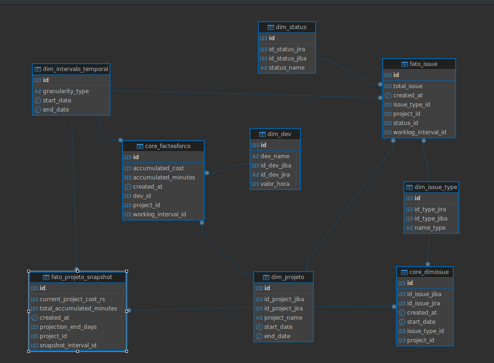

# Descrição do Modelo Dimensional de Projetos
Este modelo utiliza o esquema SnowFlake, otimizado para análises de desempenho e custos, com foco na imutabilidade dos registros de transação (Fato_issue) e na captura do estado do projeto ao longo do tempo (Fato_snapshot_projeto).

# 📊 Modelo Dimensional - Fato Issue (Snowflake)

Este documento descreve o modelo dimensional responsável por armazenar informações consolidadas sobre *issues* (tarefas, bugs, histórias, etc.) em um **Data Warehouse Snowflake**.
O modelo segue a abordagem **estrela (star schema)**, tendo uma **tabela fato central** e **dimensões auxiliares** que funcionam como filtros e eixos de análise.

---

## 🎯 Objetivo

O objetivo da **Fato Issue** é permitir consultas analíticas sobre a quantidade, esforço e tempo das *issues*, considerando diversas combinações de filtros — como **projeto**, **tipo de issue**, **status**, **usuário responsável** e **intervalo temporal**.

Em Snowflake, este modelo permite a geração de painéis dinâmicos e agregações eficientes, aproveitando recursos como **micro-particionamento**, **result caching** e **query pruning**.

## 🧮 Tabelas

### **1️⃣ Tabela Fato: `FatoIssue`**

Contém os dados quantitativos e métricas que serão analisados.

| Coluna | Tipo | Descrição |
|--------|------|-----------|
| `id_fato` | INTEGER | Identificador único do registro de fato |
| `id_projeto` | INTEGER | Chave estrangeira para `DimProjeto` |
| `id_issue_type` | INTEGER | Chave estrangeira para `DimIssueType` |
| `id_status` | INTEGER | Chave estrangeira para `DimStatus` |
| `id_tempo` | INTEGER | Chave estrangeira para `DimTempo` |
| `total_issues` | NUMBER | Total de issues no período |
| `total_esforco_horas` | NUMBER | Soma do tempo estimado ou logado nas issues |
| `tempo_medio_dias` | NUMBER | Média de tempo de resolução |

> 💡 **Em Snowflake**, as colunas de data podem ser armazenadas como `DATE`, e cálculos de agregação (como média ou soma) são executados de forma nativa e eficiente via `SUM()`, `AVG()`, `COUNT()`.

---

### **2️⃣ Dimensões**

Cada **dimensão representa um filtro selecionável** nas análises do Data Warehouse.
Exemplo: ao gerar um dashboard, o usuário pode filtrar por **projeto**, **tipo de issue**, **status** ou **intervalo de tempo**.

| Dimensão | Chave | Filtro que representa |
|-----------|--------|------------------------|
| `DimProjeto` | `id_projeto` | Projeto selecionado |
| `DimIssueType` | `id_issue_type` | Tipo de issue (Bug, História, Tarefa) |
| `DimStatus` | `id_status` | Situação atual da issue (Aberta, Fechada, Em progresso) |
| `DimTempo` | `id_tempo` | Intervalo temporal da análise |

---

## 🧠 Lógica de Cálculo

A carga da **Fato Issue** combina as dimensões e realiza a contagem e agregação das issues com base nas combinações possíveis entre:

- Projeto (`DimProjeto`)
- Tipo de issue (`DimIssueType`)
- Status (`DimStatus`)
- Tempo (`DimTempo`)

---

### ⚙️ Benefícios do Snowflake neste Modelo

Separação clara entre compute e storage, permitindo escalar consultas analíticas sem afetar ingestões de dados.
Micro-particionamento automático para colunas de data (DimTempo), otimizando queries temporais.
Caching inteligente para consultas repetidas sobre dimensões pequenas (como DimStatus ou DimIssueType).
