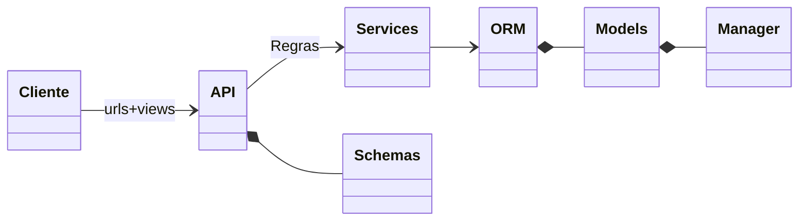
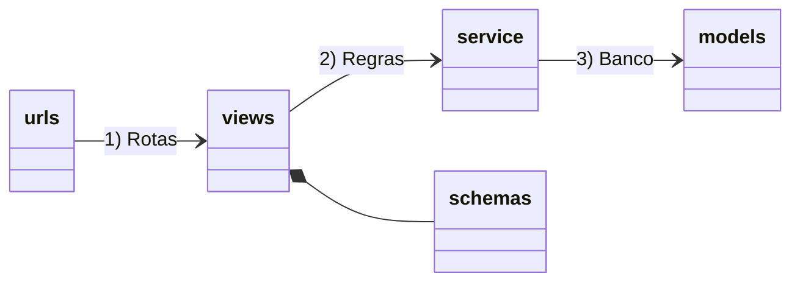

## TECH 
### BACKEND Django API

### Organização das camadas



- **Cliente**: Chamadas HTTP para a API
- **API**: Tem as definições de rotas e validação dos dados de entrada, sem ou pouca regras de negócio, redireciona os dados para a camada de serviço
- **Services**: Módulos python puro com a implementação das regras de negócio, é a camada que mais deve ser testada
- **ORM**: Mapeamento dos dados na base de dados


### Estrutura de pastas

Visao geral

```shell
jiboia                   👉 Pasta raiz do projeto
 ├── README.md
 ├── manage.py                     👉 Django CLI (Ponto de entrada)
 ├── requirements.txt              👉 Dependencias principais
 ├── requirements-dev.txt          👉 Dependencias locais (pode mudar no modo Poetry)
 ├── pyproject.toml
 ├── uwsgi.ini
 └── jiboia              👉 base do projeto
    ├── base                       👉 app para regras fora do "core"
    │   └── ...
    ├── accounts                   👉 app relacionado a usuarios e autenticacao
    │   └── ...
    ├── core                       👉 app principal com o "core business" 
    │   └── ...
    └── jiboia           👉 centraliza configuracoes do projeto
        ├── api.py
        ├── settings.py            👉 Configuracoes principal do Django
        ├── urls.py                👉 Configuracao principal/inicial das rotas no Django
        └── wsgi.py
```

O Django tem o conceito de "apps" com a ideia de separar os contextos do seu projeto, ao invés de ter tudo na app principal, podemos ir criando novas apps como por exemplo, dashboard, issue, issue,  agrupar funcionalidades da mesma natureza. Cada app segue a estrutura abaixo: 



```shell
├── core                       👉 Raiz da django app para centralizar uma solução de um dado contexto
│   ├── apps.py                👉 Como um __init__ da app
│   ├── urls.py                👉 1) Definição das rotas
│   ├── views.py               👉 1) Implementação das rotas
│   ├── schemas.py             👉 1) Definição dos atributos nome/tipo 
│   ├── service                👉 2) Implementação das regras de negócio
│   ├── models.py              👉 3) Definição das tabelas para salvar os dados
│   ├── migrations             👉 3) Histórico de como criar/alterar as tabelas no banco de dados
│   ├── admin.py               👉 Configuração dos dados que podemos acessar via back-office
│   ├── tests                  👉 Centraliza os testes da app
│   └── templates              👉 Não utilizado nas apps de API, mas pode gerar páginas HTML


```

## Requisitos

- Git
- 🐍 Python 3.11.x 
- Um terminal (de preferência um terminal Linux, é para funcionar em um terminal WSL no Windows)

Temos duas formas para **Rodar**:
- Sem Docker 📦: Apenas **Python** instalando requiriments.txt
- Apenas Banco de dados usando 🐋 Docker (melhor para debug)

## Settings opções


### CORS (Cross-Origin Resource Sharing)

1. **Adicionar o pacote `corsheaders` apenas em ambiente de desenvolvimento:**
   - No bloco de apps:
     ```python
     if DEBUG:
         THIRD_PARTY_APPS += ['corsheaders']
     ```

2. **Adicionar o middleware do CORS antes do `CommonMiddleware` apenas em desenvolvimento:**
   - No bloco de middlewares:
     ```python
     if DEBUG:
         before_common = MIDDLEWARE.index("django.middleware.common.CommonMiddleware")
         MIDDLEWARE.insert(before_common, "corsheaders.middleware.CorsMiddleware")
     ```

3. **Configurar as origens permitidas e credenciais para CORS apenas em desenvolvimento:**
   - No bloco de configurações:
     ```python
     if DEBUG:
         CORS_ALLOW_CREDENTIALS = config("CORS_ALLOW_CREDENTIALS", default=False, cast=bool)
         CORS_ALLOWED_ORIGINS = config(
             "CSRF_TRUSTED_ORIGINS",
             default="http://localhost:3000",
             cast=Csv(),
         )
     ```

---

### LOGGING

1. **Exemplo de configuração de logging customizado:**
   - Estrutura sugerida para o dicionário `LOGGING`:
     ```python
     LOGGING = {
         'version': 1,
         'formatters': {
             'verbose': {
                 'format': '%(levelname)s %(asctime)s %(module)s %(process)d %(thread)d %(message)s'
             },
             'simple': {
                 'format': '%(levelname)s %(message)s'
             },
         },
         'filters': {
             'require_debug_false': {
                 '()': 'django.utils.log.RequireDebugFalse',
             }
         },
         'handlers': {
             'console': {
                 'level': 'DEBUG',
                 'class': 'logging.StreamHandler',
                 'formatter': 'simple'
             },
             'file': {
                 'level': 'DEBUG',
                 'class': 'logging.FileHandler',
                 'filename': os.getenv('DJANGO_LOG_FILE', './jiboia.log'),
                 'formatter': 'simple'
             },
         },
         'loggers': {
             '': {
                 'handlers': ['file'],
                 'level': 'DEBUG' if DEBUG else 'INFO',
                 'propagate': True,
             },
             'django': {
                 'handlers': ['file'],
                 'level': 'DEBUG' if DEBUG else 'INFO',
                 'propagate': True,
             },
         }
     }
     ```

2. **Em ambiente de desenvolvimento, faça todos os loggers usarem o console:**
   ```python
   if DEBUG:
       # make all loggers use the console.
       for logger in LOGGING['loggers']:
           LOGGING['loggers'][logger]['handlers'] = ['console']
   ```

---

